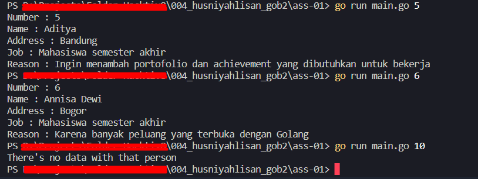

# Data Diri
Kode Peserta : 149368582100-4

Nama Lengkap : Husniyah Lisan

Assignment   : Menampilkan person data

# Panduan
1. Buka terminal pada VS Code. Anda dapat menekan tombol _Ctrl+Shift+`_
2. Ketik perintah berikut pada terminal untuk masuk ke dalam folder assignnment 1
   ```
   cd ass-01
   ```
3. Jalankan program, ketik perintah berikut pada terminal
   ```
   go run main.go
   ```
4. Jika berhasil maka output-nya adalah sebagai berikut:
